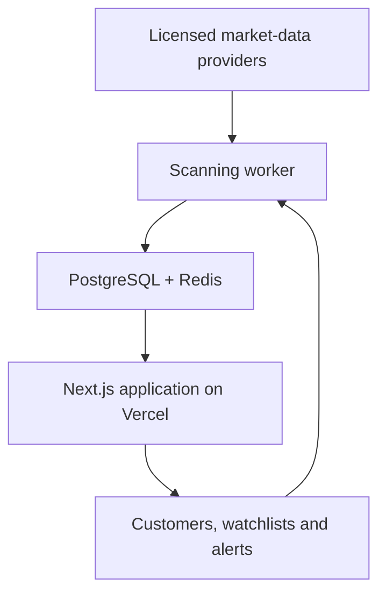

# APEX Scanner v2 MVP

APEX Scanner separates the customer-facing Vercel application from the market-data scanning engine. The repository now defaults to mocked market data so scanner logic can be validated before any commercial vendor feed is connected.

## Production boundary



- **Vercel application:** landing pages, auth, dashboard, scanner results, watchlists, alerts, Stripe Checkout/billing portal, admin controls, and short authenticated API requests.
- **Scanning worker:** vendor ingestion, normalization, indicator calculation, concurrency, retries, rate-limit handling, immutable snapshots, and alert triggering.
- **MVP worker:** use mocked data first. Inngest is the recommended durable-job layer for scanning 25–100 symbols every few minutes from a Next.js app.
- **Full-market live ingestion:** use a dedicated long-running worker outside Vercel Functions.

## Market-data licensing guardrails

- Netrows is not a stock-fundamentals provider and is not part of the scanner.
- Polygon.io is now Massive. The Massive adapter is intentionally disabled until a Business agreement covers this product's display, redistribution, and derived-signal model.
- FlashAlpha is intentionally disabled until written commercial display and redistribution rights are confirmed.
- Do not build around unverified FlowAlgo enterprise endpoints until FlowAlgo supplies API documentation and commercial rights in writing.
- SmartFlow Proxy is derived from price and volume behavior. Do not market it as institutional order-flow data.

## Scoring model

The scanner returns separate measurements:

1. **Setup score** — technical strength.
2. **Confidence** — completeness, freshness, sample sufficiency, and provider health.
3. **Signal state** — `WATCHING`, `DEVELOPING`, `CONFIRMED`, or `INVALIDATED`.

Technical score weights:

| Component | Weight |
| --- | ---: |
| Relative Volume | 25% |
| Breakout Structure | 20% |
| Momentum | 15% |
| Liquidity | 15% |
| Options Positioning | 15% |
| Flow Confirmation | 10% |

Confidence is calculated separately:

```text
Confidence = data completeness × data freshness × sample sufficiency × provider health
```

## Storage plan

| Storage | Information |
| --- | --- |
| PostgreSQL | Users, plans, watchlists, alerts, snapshots, audit records |
| Redis | Current quotes, rate limits, scan locks, temporary results |
| Object storage | Historical exports and large backtesting files |

On Vercel, use Marketplace providers for databases/cache: Vercel Postgres is no longer first-party and existing databases were migrated to Neon through the Vercel Marketplace in December 2024; Vercel KV is no longer first-party and existing stores were migrated to Upstash Redis through the Vercel Marketplace in December 2024. Vercel Blob remains first-party and is the right fit for exported files and large backtesting artifacts.

## Run the mocked scanner

```bash
npm run scan
```

Optional symbols:

```bash
APEX_SYMBOLS=NVDA,MSFT,SPY npm run scan
```

The scanner prints scored results and writes an immutable JSON snapshot under `data/snapshots/`.

## Validate

```bash
npm test
```

## Before selling access

- Keep vendor keys server-side.
- Validate every request with schemas.
- Rate-limit by user, IP, and subscription plan.
- Verify Stripe webhook signatures and make webhooks idempotent.
- Add database ownership policies and audit events.
- Display market timestamps and delayed-data labels.
- Publish terms, privacy policy, refund policy, and market-data disclosures.
- Have counsel review whether rankings, alerts, and language create investment-advice risk.
