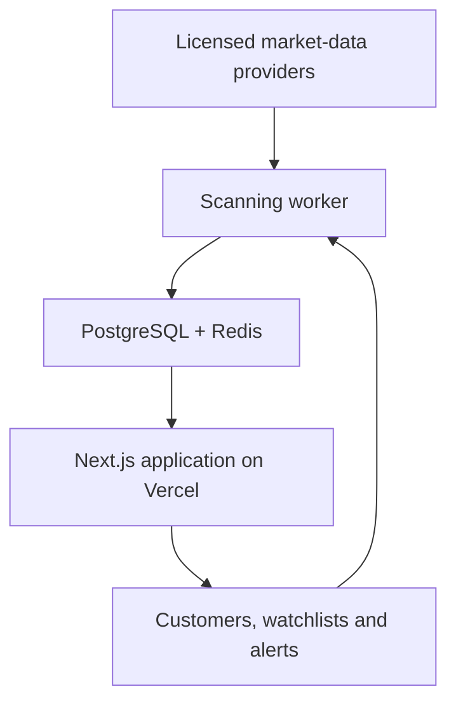

# APEX Scanner v2 Production Architecture

## Corrected system design



## Vercel application responsibilities

- Landing and pricing pages
- Authentication
- User dashboard
- Scanner results
- Watchlists
- Alert management
- Stripe Checkout and billing portal
- Admin controls
- Short authenticated API requests

Vercel should not run a continuous market-wide WebSocket scanner. Keep Vercel Functions focused on web requests, webhook handlers, and short APIs.

## Scanning worker responsibilities

- Receive live or delayed vendor data
- Normalize vendor-specific responses
- Calculate indicators
- Scan tickers with bounded concurrency
- Save immutable scanner snapshots
- Trigger alerts
- Retry temporary vendor failures
- Enforce vendor rate limits

For 25–100 symbols every few minutes, use Inngest from the Next.js app. For full-market real-time ingestion, run a dedicated worker on long-running compute.

## MVP repository structure

```text
src/
  domain/
    indicators/
    scoring/
  infrastructure/
    providers/
  jobs/
docs/
tests/
data/snapshots/
```

Provider adapters remain disabled until commercial rights are confirmed. The mocked adapter is the only active adapter by default.

## Essential tables for the paid product

| Table | Purpose |
| --- | --- |
| profiles | Customer account information |
| subscriptions | Stripe plan and access status |
| symbols | Tradable ticker metadata |
| watchlists | User-created lists |
| watchlist_symbols | Symbols belonging to each list |
| scan_runs | One record for every scanner execution |
| scan_results | Scores and indicator values |
| alert_rules | User alert conditions |
| alert_events | Trigger history and delivery status |
| provider_health | Vendor latency and error information |
| audit_events | Important account and system changes |

Every scan result must retain provider, market timestamp, processing timestamp, indicator version, score-engine version, data freshness, and explanation fields.
