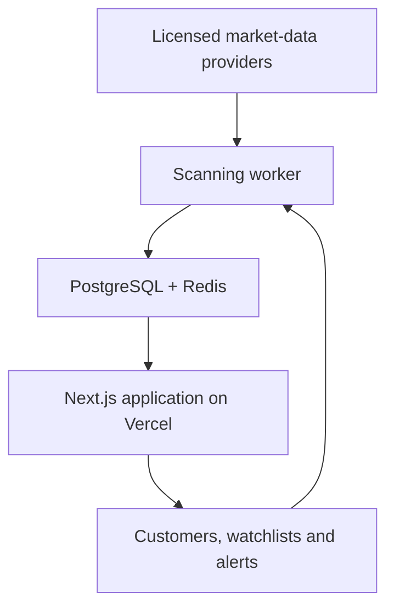

# APEX Scanner v2 Production Architecture

## Corrected system design



## Vercel application responsibilities

- Landing and pricing pages
- Authentication
- User dashboard
- Scanner results
- Watchlists
- Alert management
- Stripe Checkout and billing portal
- Admin controls
- Short authenticated API requests

Vercel should not run a continuous market-wide WebSocket scanner. Keep Vercel Functions focused on web requests, webhook handlers, and short APIs.

## Scanning worker responsibilities

- Receive live or delayed vendor data
- Normalize vendor-specific responses
- Calculate indicators
- Scan tickers with bounded concurrency
- Save immutable scanner snapshots
- Trigger alerts
- Retry temporary vendor failures
- Enforce vendor rate limits

For 25–100 symbols every few minutes, use Inngest from the Next.js app. For full-market real-time ingestion, run a dedicated worker on long-running compute.

## MVP repository structure

```text
src/
  domain/
    indicators/
    scoring/
  infrastructure/
    providers/
  jobs/
docs/
tests/
data/snapshots/
```

Provider adapters remain disabled until commercial rights are confirmed. The mocked adapter is the only active adapter by default.


## Provider configuration policy

Provider adapters are server-only. The scanner should read provider keys from runtime environment variables, never from browser code and never from `NEXT_PUBLIC_*` variables.

| Variable | Status | Use |
| --- | --- | --- |
| `MARKET_DATA_PROVIDER=mock` | Active | Default MVP provider |
| `MASSIVE_API_KEY` | Reserved | Enable only after a Massive Business agreement covers display, redistribution, and derived signals |
| `FLASHALPHA_API_KEY` | Reserved | Enable only after written commercial display/redistribution rights are confirmed |
| `FLOWALGO_API_KEY` | Reserved | Enable only after verified enterprise API docs and negotiated commercial rights |

A production activation PR should include the signed-rights reference, provider rate-limit policy, retry/backoff behavior, provider-health logging, and UI disclosure labels before changing `MARKET_DATA_PROVIDER` away from `mock`.

## Essential tables for the paid product

| Table | Purpose |
| --- | --- |
| profiles | Customer account information |
| subscriptions | Stripe plan and access status |
| symbols | Tradable ticker metadata |
| watchlists | User-created lists |
| watchlist_symbols | Symbols belonging to each list |
| scan_runs | One record for every scanner execution |
| scan_results | Scores and indicator values |
| alert_rules | User alert conditions |
| alert_events | Trigger history and delivery status |
| provider_health | Vendor latency and error information |
| audit_events | Important account and system changes |

Every scan result must retain provider, market timestamp, processing timestamp, indicator version, score-engine version, data freshness, and explanation fields.

## Stripe and subscription safety

Subscriptions are controlled by verified webhooks, not by a checkout-success redirect. The webhook handler must verify signatures, process each Stripe event once, update the `subscriptions` table from authoritative Stripe events, and write audit records for access changes.

## Inngest and worker safety

For the MVP, enqueue scans as durable jobs with bounded concurrency, retries, cache reads/writes, provider rate-limit handling, and immutable scan-run persistence. Vercel request handlers should trigger or read scan state; they should not run continuous full-market WebSocket ingestion.

## Security requirements before paid beta

- Vendor keys stay server-side.
- Every request is schema-validated.
- Rate-limit by user, IP, and subscription plan.
- Apply database ownership policies and Supabase RLS if Supabase is used.
- Encrypt sensitive configuration through managed secret stores.
- Record provider health, alert delivery, and audit events.
- Display market timestamps and delayed-data labels.
- Publish terms, privacy policy, refund policy, and market-data disclosures.
- Avoid language that promises guaranteed profits or implies personalized investment advice.
